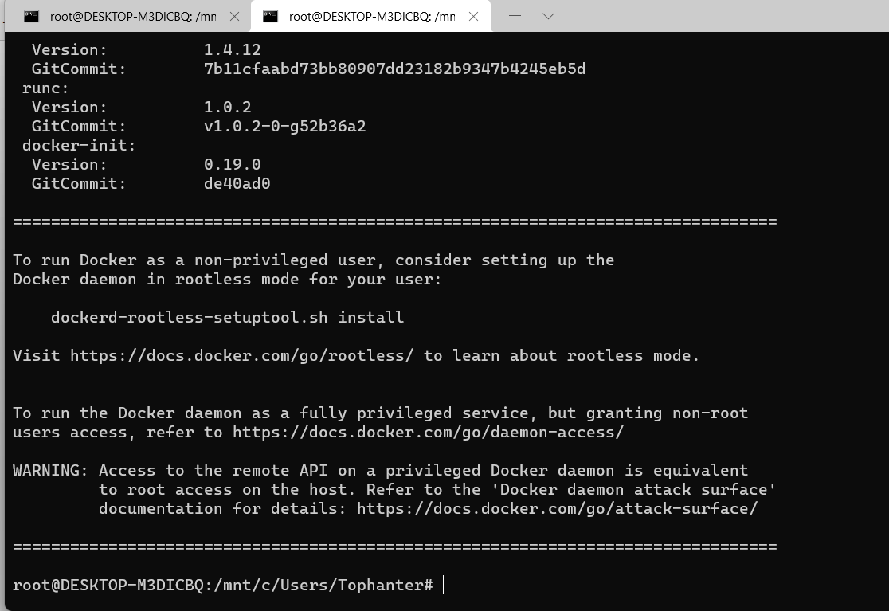

    开箱即用的docker版本，所有环境与依赖都已封装在镜像内，使用方便快捷。

[TOC]

## 视频安装教程

[QingScan视频安装教程](https://www.bilibili.com/video/BV1wP4y1G74V)


## 1. 安装docker
```
curl -sSL https://get.daocloud.io/docker | sh
```



## 2. 安装docker-compose

安装compose命令如下：
```
sudo curl -L https://get.daocloud.io/docker/compose/releases/download/1.25.1/docker-compose-`uname -s`-`uname -m` -o /usr/local/bin/docker-compose
```


设置可执行权限
```
sudo chmod +x /usr/local/bin/docker-compose
```

## 3. 下载QingScan代码
```
git clone https://github.com/78778443/QingScan.git
```

## 4. 安装教程
启动容器
```
cd QingScan/docker/latest  && docker-compose up -d 
```

 <b>首次</b>启动需要更新容器内代码
```
docker exec  qingscan sh -c 'cd /root/qingscan && git fetch && git reset --hard origin/main  && rm code/public/install/install.lock' 
```
## 5. 创建数据库
依次执行命令创建MySQL数据库

进入容器
```
docker exec -it  mysqlser bash
``` 

进入数据库

```
mysql -uroot -p123
```

创建数据库
```
CREATE DATABASE IF NOT EXISTS QingScan;
```

## 6.访问应用

浏览器访问  http://127.0.0.1:8000/ 自动进入安装界面

> 1. fortify 涉及许可证问题，镜像内不包含，需要自己将Linux版本的fortify放到`/data/tools`文件夹中
> 2. AWVS 调用主要通过API，需要自己将API配置系统，配置管理中去


