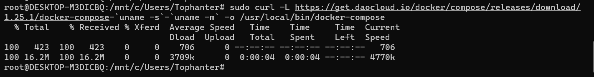
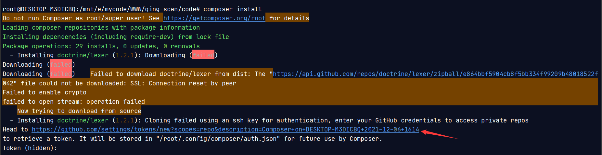
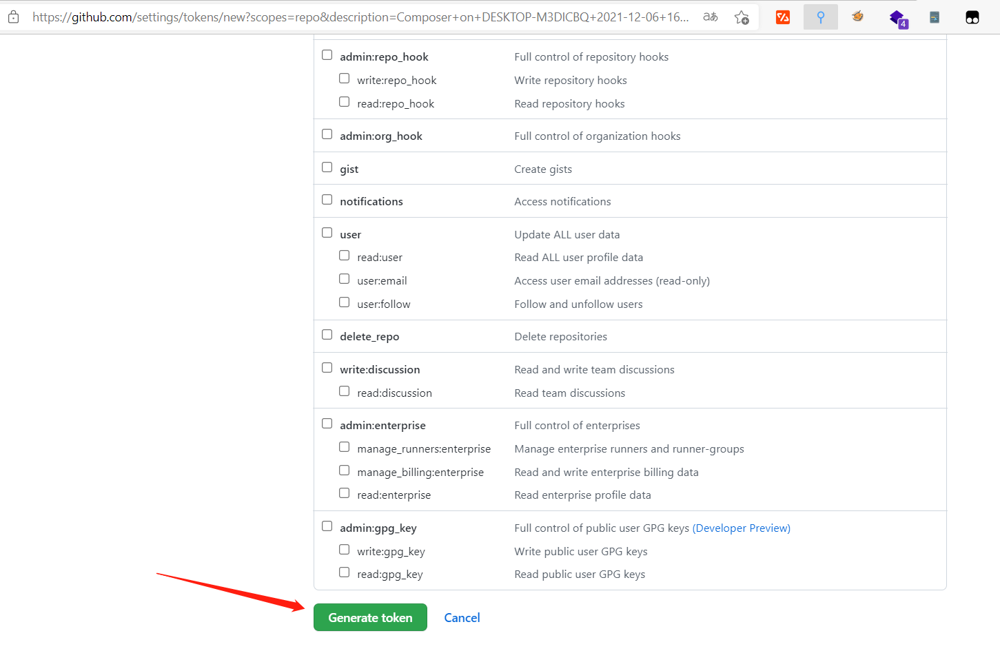

QingScan提供两种方式安装，

1、 开箱即用的docker版本，所有环境与依赖都已封装在镜像内，使用方便快捷。

2、 另一种是源代码安装方式，适用于开发者边开发边调试。

[TOC]

## 安装方法一、QingScan-docker版本安装

#### 1. 安装docker
```
curl -sSL https://get.daocloud.io/docker | sh
```


#### 2. 安装docker-compose
众所周知的原因，国外的网站连接速度很慢。因此安装的时间可能会比较长，我们建议使用国内阿里云镜像
```
composer config -g repo.packagist composer https://mirrors.aliyun.com/composer/
```

安装compose命令如下：
```
sudo curl -L https://get.daocloud.io/docker/compose/releases/download/1.25.1/docker-compose-`uname -s`-`uname -m` -o /usr/local/bin/docker-compose
```


#### 3. 添加可执行权限
```
sudo chmod +x /usr/local/bin/docker-compose
```

#### 4. 下载QingScan
```
https://github.com/78778443/QingScan  
```

#### 5. 拉去镜像并自动运行项目
进入20211014_01目录下,拉取镜像并自动启动项目
```
cd QingScan/docker/20211014_01 && docker-compose up
```


--------------------------------------------------------------------------------------------------------------------我是漂亮的分割线~


##  安装方法二、QingScan-源码安装

#### 1. 下载QingScan
```

https://github.com/78778443/QingScan  
```
进入目录qing-scan/code
```
cd qing-scan/code
```

#### 2. 安装视图驱动
```
composer require topthink/think-view
```

#### 3. 安装扩展
```
apt install php-intl php-pdo php-mysqli
```

#### 4. 安装composer
```
composer install
```

点击进入如下网址



点击生成token



复制刚生成的token


粘贴到此处，然后回车


#### 5. 运行项目
```
cd /qing-scan/code && php think run
```

接下来通过浏览器去访问ip:8000

