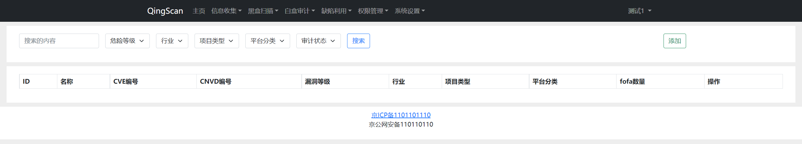
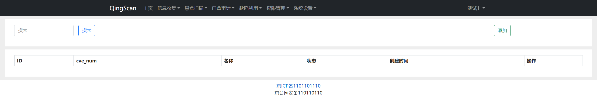
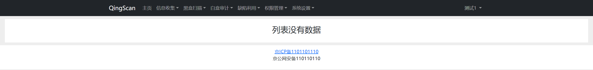
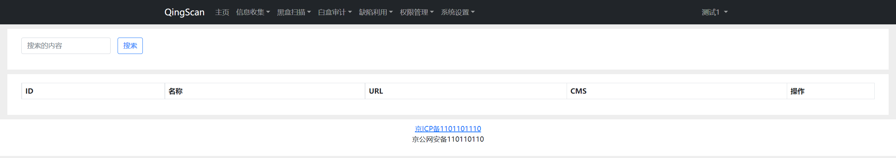

## 一、缺陷目标

缺陷目标是需要在网络中收集漏洞情报，然后在`缺陷利用`->`缺陷列表`中找到`添加`按钮

>目前QingScan暂不提供缺陷信息，缺陷需要用户自行填写

## 二、编写POC

在`缺陷利用`->`POC列表`中找到`添加`按钮，将你的`POC`添加进来，目前支持 `xray`和`pocsuite3`的POC格式

>目前QingScan暂不提供Poc信息，Poc需要用户自行填写

##  三、开始验证
在`缺陷利用`->`缺陷目标收集`列表中可以看到，通过缺陷目标的信息采集到可能存在漏洞的列表信息

## 四、查看结果

在`缺陷利用`->`漏洞实例`列表中可以看到，通过Poc验证完的漏洞列表
