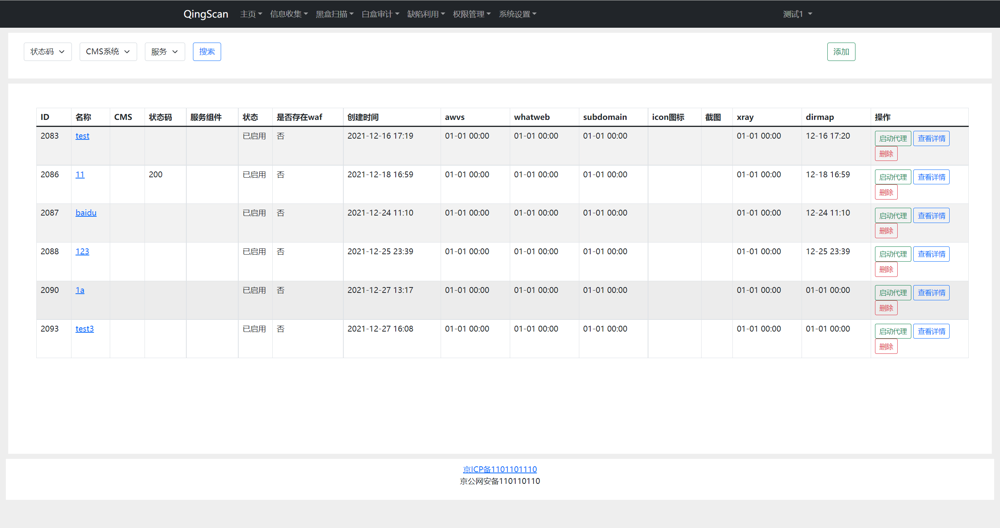
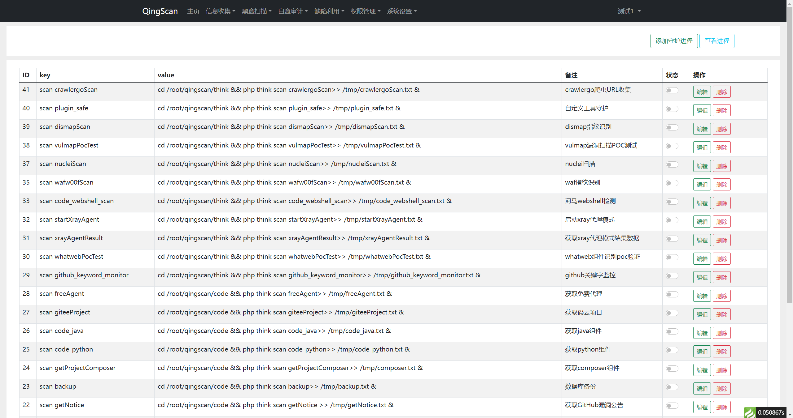
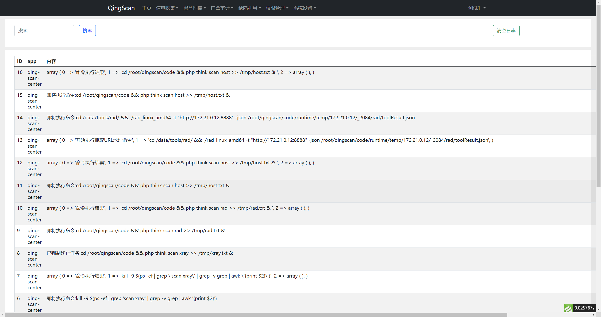
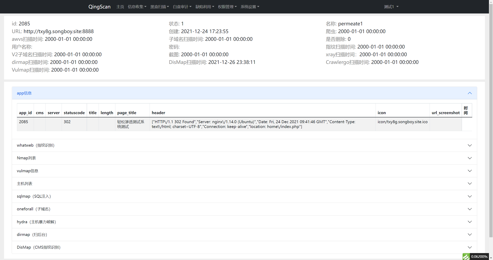

## 一、添加目标

在 `黑盒扫描`->`目标管理` 页面中，找到添加`目标`按钮，将你的目标添加进来

## 二、开启工具

在`系统设置`->`守护进程管理`页面中，将需要使用的工具设置为开启状态

## 三、查看进度
QingScan调用各种工具时候都会写入日志，你可以在在`系统设置`->`日志管理`中找到相应的信息

##  四、查看结果
在 `黑盒扫描`->`目标管理` 页面中，找到下方目标列表的`查看详情`按钮

