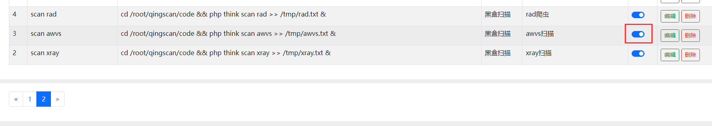

## 1、安装成功后127.0.0.1:8000访问不了
    在docker外面，输入ifconfig，查看ip多少（如下图示例），复制粘贴这个IP访问试试（如不行查看8000端口是否开启）


## 2、安装时提示数据库信息有误
在docker外面，输入ifconfig，查看ip多少（如下图示例），复制粘贴到‘**数据库地址**’中再提交


## 3、代码更新（不重新安装）
    docker exec qingscan sh -c 'cd /root/qingscan && git fetch && git reset --hard origin/main

## 4、代码更新（并且重装）
    docker exec qingscan sh -c 'cd /root/qingscan && git fetch && git reset --hard origin/main && rm code/public/install/install.lock'

## 5、安装成功后登录上去打开进程后发现没有日志
    杀掉safe进程（php think scan safe），如：kill -9 pid

## 6、Mac用户

苹果电脑系统不支持docker的host网络模式，所以需要使用端口映射模式，将`docker/latest/docker-compose.yaml`文件将18行注释,将23行，24行注释给打开,如下所示

```
#   network_mode: "host"
```
```
    ports:
      - "8000:8000"
```

## 7、数据库连接错误

1. 如果你是非mac系统，并且按照视频安装的出现网络错误，在第二步填写配置页面，多尝试几次下一步，有时候网络莫名其妙出现错误，多试几次就好了。
2. 如果你是mac用户，那么安装的时候使用的是端口隐射的模式，这个时候需要你将数据库地址从127.0.0.1换成你电脑本身的IP地址。

## 8、AWVS使用教程

1. 安装docker版的AWVS镜像（qingscan和awvs装在同一台服务器中）。

   docker pull secfa/docker-awvs # 拉取镜像
   
    docker run -it -d -p 13443:3443 secfa/docker-awvs # 运行容器
   
    ifconfig 查看ip

    
   
    访问地址：https://ip:13443

    

    默认账号：admin@admin.com

    默认密码：Admin123

2. 安装成功后，复制AWVS访问的url地址和token,去qingscan平台中修改相应的配置信息

    

    

    

3. 开启AWVS守护进程

    

4. 添加一个黑盒项目，自动启动扫描，此时可以在日志管理中查看扫描状态 

    

5. 稍等一会后可以在AWVS当中查看到该条扫描记录，坐等扫描结束。
    
    
