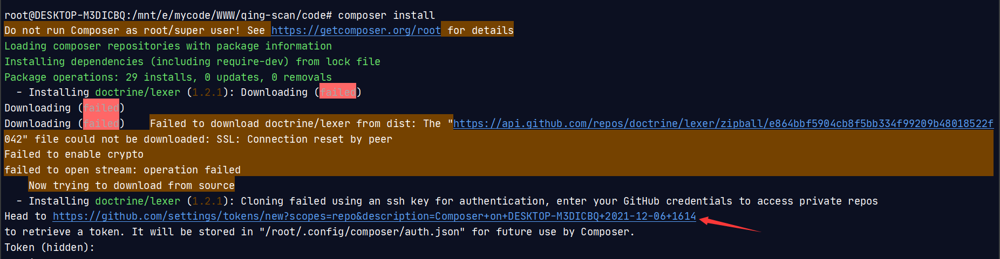
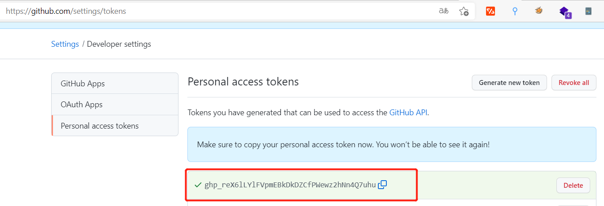
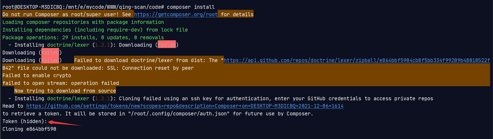

## 1. 下载QingScan
```

https://github.com/78778443/QingScan  
```
进入目录qing-scan/code
```
cd qing-scan/code
```


## 2. 安装扩展
```
apt install php-intl php-pdo php-mysqli
```
## 3. 安装依赖
```
composer install
```
### 4. 导入数据


## 4. 运行项目
```
cd /qing-scan/code && php think run
```

接下来通过浏览器去访问URL地址：`http://host:8000/` 

用户名：`test1` 密    码：`123456`


## 5. 异常解决

下面是在安装过程中可能会遇到的异常问题，如果没有遇到可以忽视~

### 5.1 安装依赖异常

如果在使用`composer install`出现GitHub认证提示，不需要慌张；点击提示中的链接进入GitHub网址，生成Token，方法如下所示


点击生成token


复制GitHub中生成的token



粘贴到终端的输入位置，然后按下回车键，即可安装完成

