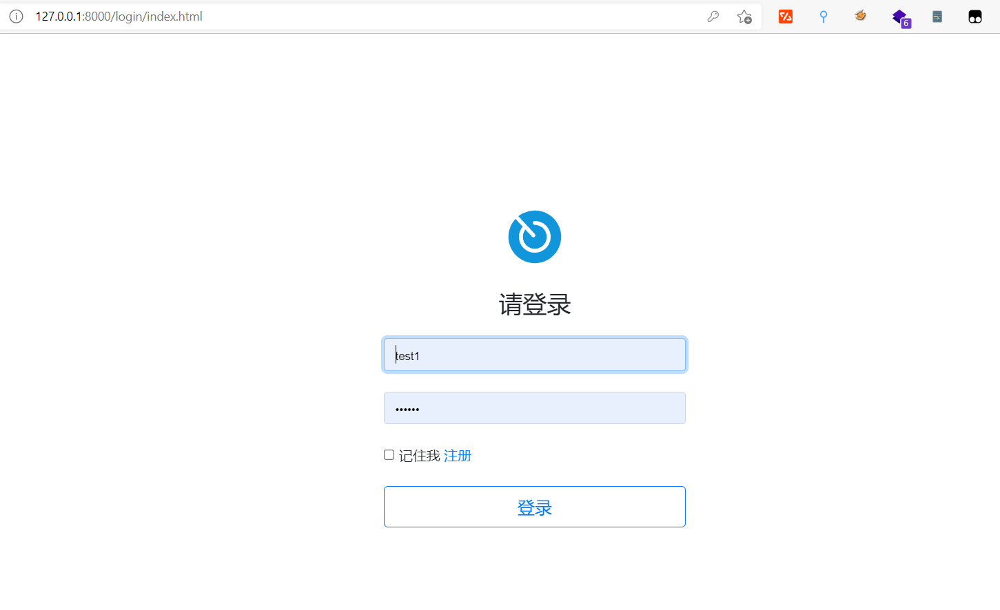

## 1. 下载QingScan
```

https://github.com/78778443/QingScan  
```
进入目录qing-scan/code
```
cd qing-scan/code
```

## 2. 安装视图驱动
```
composer require topthink/think-view
```

## 3. 安装扩展
```
apt install php-intl php-pdo php-mysqli
```

## 4. 安装composer
```
composer install
```

点击进入如下网址


点击生成token


复制刚生成的token


粘贴到此处，然后回车


## 5. 运行项目
```
cd /qing-scan/code && php think run
```

接下来通过浏览器去访问`http://host:8000/`

