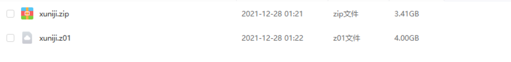
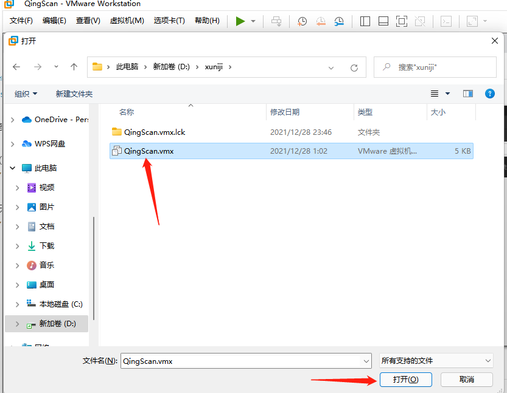
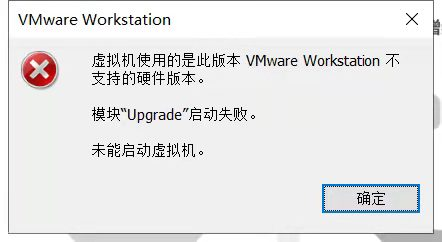
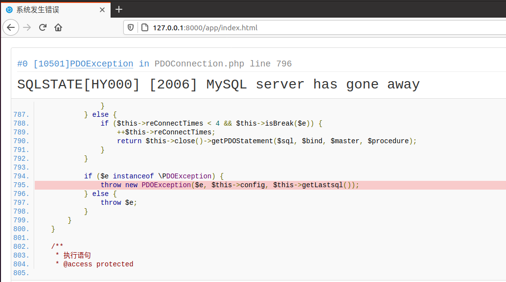

##  一、虚拟机下载


### 1.1 百度网盘:
```
链接：https://pan.baidu.com/s/19zu8iUJ_DndO7kDGtWrN7Q 
提取码：319b 
```

### 1.2 奶牛快传
```
传输链接：https://cowtransfer.com/s/a62fb4d1f3174e 
或 打开【奶牛快传】cowtransfer.com 使用传输口令：vfngml 提取；
```
没有百度会员的小伙伴下载速度会比较慢,建议使用奶牛快传下载速度更快

下载成功可以看见两个文件（如下图所示）,此文件是分卷压缩，需要两个文件都下载才可以解压，


## 二、启动虚拟机
解压成功后，通过VMware去打开虚拟机，如下图所示


虚拟机账号密码
```
qingscan
123456
root
root
```
如果有重启虚拟机，导致项目容器被关闭的，执行以下命令启动即可
```
service docker start
docker start mysqlser qingscan
```
接下来通过浏览器访问`http://ip:8000/`


-------------------------------------------------------------------------------------------------------------------------------------------分割线
## 三、虚拟机常见问题

### 3.1 虚拟机使用的是此版本VMware Workstationbu不支持的硬件版本，解决方案：
https://blog.csdn.net/Aluxian_/article/details/121976782





### 3.2 `MySQL server has gone away`mysql报错，重启虚拟机，开启容器即可：
```
service docker start
docker start mysqlser qingscan
```




